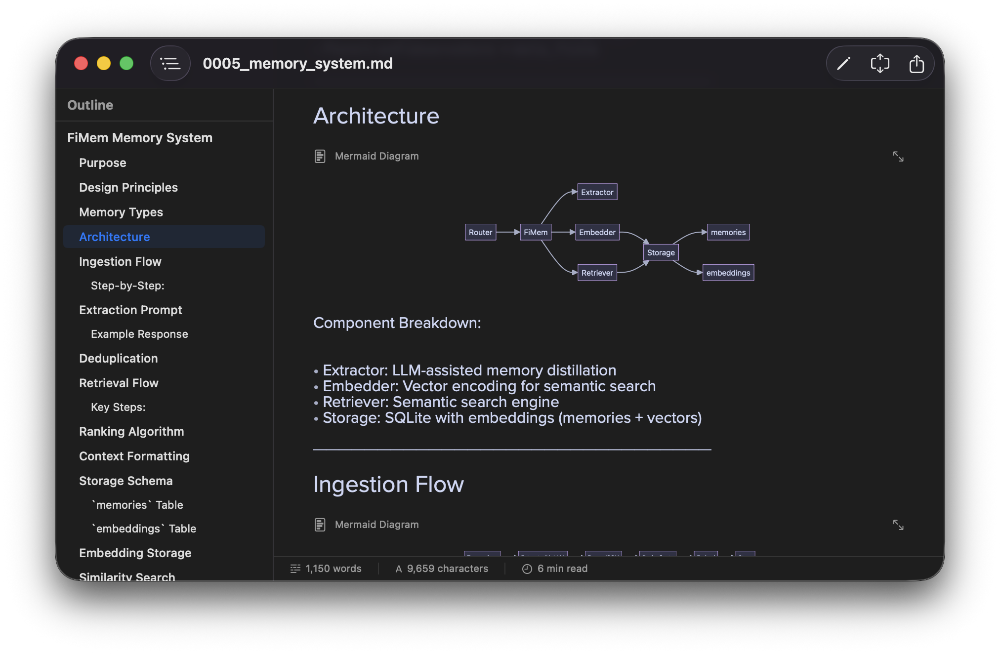

# VoidReader


A native macOS markdown viewer for people who actually read markdown.

Reader-first. Native rendering. No Electron. No web views for text. Just your documents, rendered beautifully.



## Why

Every markdown app wants to be an IDE. VoidReader wants to be a *reader*.

Polite nod to the ancestors:

- **Typora** - Great, but reader mode is an afterthought
- **Obsidian** - Vault-based, plugin ecosystem, more than you need
- **MacDown** - Split pane editor from 2014
- **VS Code** - You opened a text editor to read a document?

VoidReader opens markdown files and shows them to you. That's it. That's the app.

## Features

### Reading
- **Native text rendering** - AttributedString, not HTML. Scrolls like butter.
- **Mermaid diagrams** - Flowcharts, sequence diagrams, rendered inline
- **LaTeX math** - KaTeX for `$$` blocks, styled inline for `$...$`
- **Syntax-highlighted code** - With one-click copy
- **Tables, task lists, images** - Full GFM support
- **Outline sidebar** - Jump to any heading
- **Print & PDF export** - Paginated output with images and diagrams

### Editing
- **Edit mode** - Toggle with Cmd+E
- **Live syntax highlighting** - AST-based, not regex
- **Markdown linter** - 8 rules to keep your docs clean
- **Format on save** - Auto-normalize list markers, whitespace, emphasis
- **Distraction-free mode** - Just you and your words
- **External change detection** - Reloads when files change on disk

### Theming
- **System theme** - Native macOS semantic colors
- **Catppuccin** - Mocha (dark) / Latte (light) built-in
- **Editor-only theming** - Keep reader native, theme just the editor
- **Custom themes** - Drop JSON in `~/Library/Application Support/VoidReader/Themes/`
- See [THEMING.md](docs/THEMING.md) for the full guide

### Distribution
- **Signed & notarized** - No Gatekeeper warnings
- **Universal binary** - Native on Intel and Apple Silicon
- **Lightweight** - ~15MB, launches instantly

## Installation

### Download
Grab the latest DMG from [Releases](https://github.com/lazypower/void-reader/releases).

Double-click. Drag to Applications. Done.

### Build from Source

```bash
# Install dependencies
brew install xcodegen swiftlint swiftformat

# Clone and build
git clone https://github.com/lazypower/void-reader.git
cd void-reader
make setup
make build

# Or run directly
make run
```

## Usage

```bash
# Open a file
open -a VoidReader document.md

# Or just double-click any .md file after setting VoidReader as default
```

### Keyboard Shortcuts

| Action            | Shortcut            |
| ----------------- | ------------------- |
| Toggle Edit Mode  | Cmd + E             |
| Toggle Outline    | Cmd + Shift + O     |
| Find              | Cmd + F             |
| Find & Replace    | Cmd + H             |
| Format Document   | Cmd + Shift + I     |
| Distraction-Free  | Cmd + Shift + F     |
| Print             | Cmd + P             |
| Increase Font     | Cmd + +             |
| Decrease Font     | Cmd + -             |
| Reset Font        | Cmd + 0             |

## Development

VoidReader uses [XcodeGen](https://github.com/yonaskolb/XcodeGen) for project management. The `project.yml` is the source of truth.

```bash
make help          # See all commands
make project       # Regenerate .xcodeproj from project.yml
make build         # Build (Debug)
make run           # Build and run
make test          # Run tests
make release       # Build (Release)
make dmg           # Build unsigned DMG
make dmg-signed    # Build signed & notarized DMG (requires Apple Developer ID)
```

### Project Structure

```
Sources/VoidReaderCore/    # Swift Package - parser, renderer, theming
App/                       # SwiftUI app shell - views, resources
QuickLookExtension/        # Quick Look preview support
project.yml                # XcodeGen config
```

### Adding Features

1. Core logic goes in `Sources/VoidReaderCore/`
2. Views go in `App/Views/`
3. Run `make project` after adding files
4. Specs live in `openspec/` if you're into that

## Tech Stack

- **Swift 5.9+** / **SwiftUI** / **macOS 14+**
- **[swift-markdown](https://github.com/apple/swift-markdown)** - Apple's markdown parser
- **[Highlightr](https://github.com/raspu/Highlightr)** - Syntax highlighting
- **[Mermaid.js](https://mermaid.js.org/)** - Diagram rendering (bundled, no Node)
- **[KaTeX](https://katex.org/)** - Math rendering (bundled)

## License

MIT. Do what you want.

## Acknowledgments

Built by someone who just wanted to read markdown without suffering.

Document icon designed by Fiona.

---

*VoidReader: Because sometimes you just want to read the damn file.*
