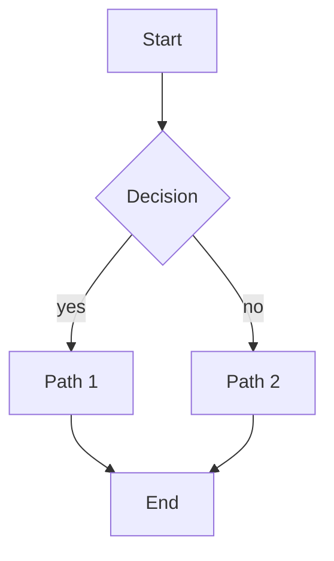

<!--
  Shape: mixed-media
  Approx size: ~3KB
  Why: images, mermaid diagrams, math, and tables together in realistic proportions exercise cross-renderer coordination. Tuned to surface WKWebView setup cost and cross-kind cache contention.
-->

# Mixed Media Fixture

Realistic document combining markdown, mermaid, math, and tables.

## Section A — Image


Inline context paragraph about the image above.

## Section B — Mermaid



## Section C — Math

Inline math: $E = mc^2$ embedded in a sentence.

Block math:

$$
\int_0^{\infty} e^{-x^2} dx = \frac{\sqrt{\pi}}{2}
$$

## Section D — Table

| Column A | Column B | Column C |
|----------|----------|----------|
| value 1  | value 2  | value 3  |
| value 4  | value 5  | value 6  |
| value 7  | value 8  | value 9  |

## Section E — Code

```swift
struct Example {
    let name: String
    func greet() -> String { "Hello, \(name)" }
}
```

## Section F — Another Image


Closing paragraph to exercise the post-media continuation renderer.
