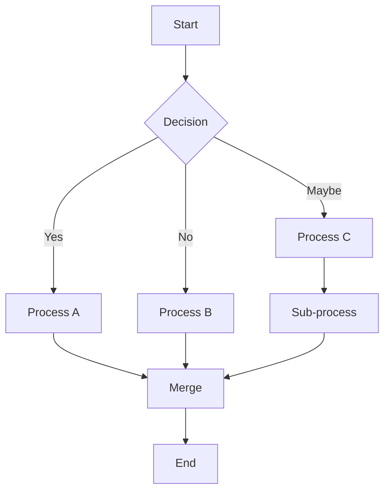
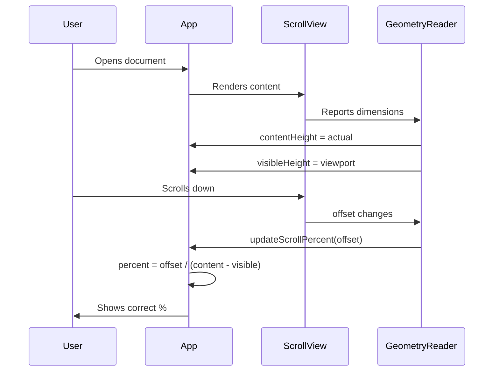
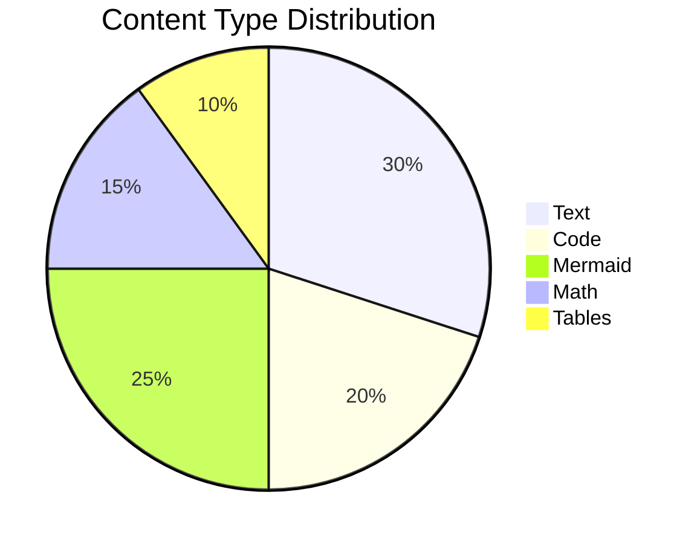

# Mixed Content Scroll Test

This document contains text, Mermaid diagrams, KaTeX math, code blocks,
and tables to produce varied block heights for scroll percentage testing.

## Section 1: Opening Text

Lorem ipsum dolor sit amet, consectetur adipiscing elit. Sed do eiusmod tempor
incididunt ut labore et dolore magna aliqua. Ut enim ad minim veniam, quis nostrud
exercitation ullamco laboris nisi ut aliquip ex ea commodo consequat.

Duis aute irure dolor in reprehenderit in voluptate velit esse cillum dolore eu
fugiat nulla pariatur. Excepteur sint occaecat cupidatat non proident, sunt in
culpa qui officia deserunt mollit anim id est laborum.

## Section 2: Mermaid Diagram



## Section 3: Code Block

```python
import asyncio
from dataclasses import dataclass
from typing import Optional

@dataclass
class ScrollTest:
    content_height: float
    visible_height: float
    offset: float

    @property
    def scrollable_height(self) -> float:
        return self.content_height - self.visible_height

    @property
    def percent(self) -> int:
        if self.scrollable_height <= 0:
            return 0
        raw = (self.offset / self.scrollable_height) * 100
        return int(min(100, max(0, raw)))

async def run_scroll_test():
    test = ScrollTest(
        content_height=24000,
        visible_height=800,
        offset=5800
    )
    print(f"Scroll: {test.percent}%")
    assert test.percent == 25, f"Expected 25%, got {test.percent}%"

asyncio.run(run_scroll_test())
```

## Section 4: Math Block

$$
\int_{-\infty}^{\infty} e^{-x^2} dx = \sqrt{\pi}
$$

The Fourier transform of a function $f(t)$ is:

$$
\hat{f}(\xi) = \int_{-\infty}^{\infty} f(t) e^{-2\pi i \xi t} dt
$$

## Section 5: Table

| Component | Height (px) | Type | Notes |
|-----------|------------|------|-------|
| Text paragraph | 20-60 | Native | Varies by length |
| Code block | 100-500 | Native | Depends on line count |
| Mermaid diagram | 200-800 | WKWebView | Async rendering |
| KaTeX math | 50-200 | WKWebView | Async rendering |
| Table | 100-400 | Native | Row count dependent |
| Image | 200-1000 | Async | Network + disk cache |

## Section 6: Another Mermaid



## Section 7: More Text

Sed ut perspiciatis unde omnis iste natus error sit voluptatem accusantium
doloremque laudantium, totam rem aperiam, eaque ipsa quae ab illo inventore
veritatis et quasi architecto beatae vitae dicta sunt explicabo.

Nemo enim ipsam voluptatem quia voluptas sit aspernatur aut odit aut fugit,
sed quia consequuntur magni dolores eos qui ratione voluptatem sequi nesciunt.

Neque porro quisquam est, qui dolorem ipsum quia dolor sit amet, consectetur,
adipisci velit, sed quia non numquam eius modi tempora incidunt ut labore et
dolore magnam aliquam quaerat voluptatem.

## Section 8: Another Code Block

```swift
struct ScrollPercentage {
    static func calculate(
        offset: CGFloat,
        contentHeight: CGFloat,
        visibleHeight: CGFloat
    ) -> Int {
        let scrollableHeight = contentHeight - visibleHeight
        guard scrollableHeight > 0 else { return 0 }
        return Int(min(100, max(0, (offset / scrollableHeight) * 100)))
    }
}

// The old buggy version estimated height:
// let estimatedBlockHeight: CGFloat = 60
// let totalHeight = CGFloat(blockCount) * estimatedBlockHeight
// This underestimated by ~4x for documents with tall blocks
```

## Section 9: More Math

Maxwell's equations in differential form:

$$
\nabla \cdot \mathbf{E} = \frac{\rho}{\varepsilon_0}
$$

$$
\nabla \cdot \mathbf{B} = 0
$$

$$
\nabla \times \mathbf{E} = -\frac{\partial \mathbf{B}}{\partial t}
$$

$$
\nabla \times \mathbf{B} = \mu_0 \mathbf{J} + \mu_0 \varepsilon_0 \frac{\partial \mathbf{E}}{\partial t}
$$

## Section 10: Final Mermaid



## Section 11: Closing

At vero eos et accusamus et iusto odio dignissimos ducimus qui blanditiis
praesentium voluptatum deleniti atque corrupti quos dolores et quas molestias
excepturi sint occaecati cupiditate non provident.

Et harum quidem rerum facilis est et expedita distinctio. Nam libero tempore,
cum soluta nobis est eligendi optio cumque nihil impedit quo minus id quod
maxime placeat facere possimus, omnis voluptas assumenda est.

Temporibus autem quibusdam et aut officiis debitis aut rerum necessitatibus
saepe eveniet ut et voluptates repudiandae sint et molestiae non recusandae.

---

*End of mixed content scroll test document.*
