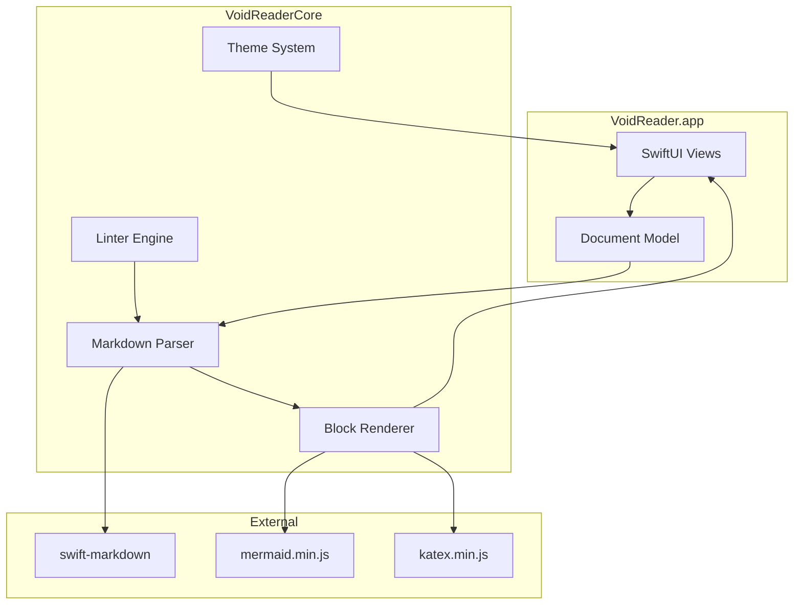
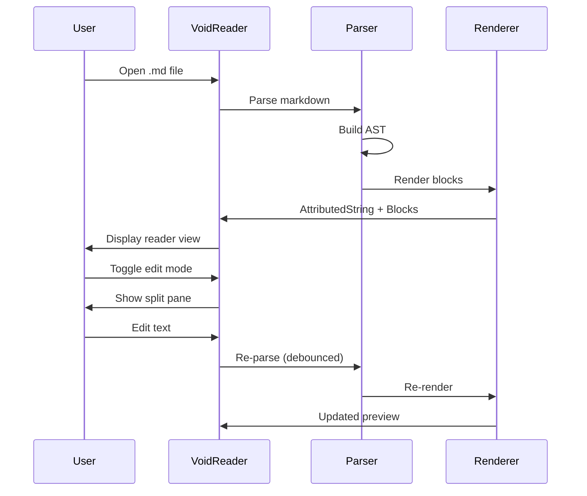
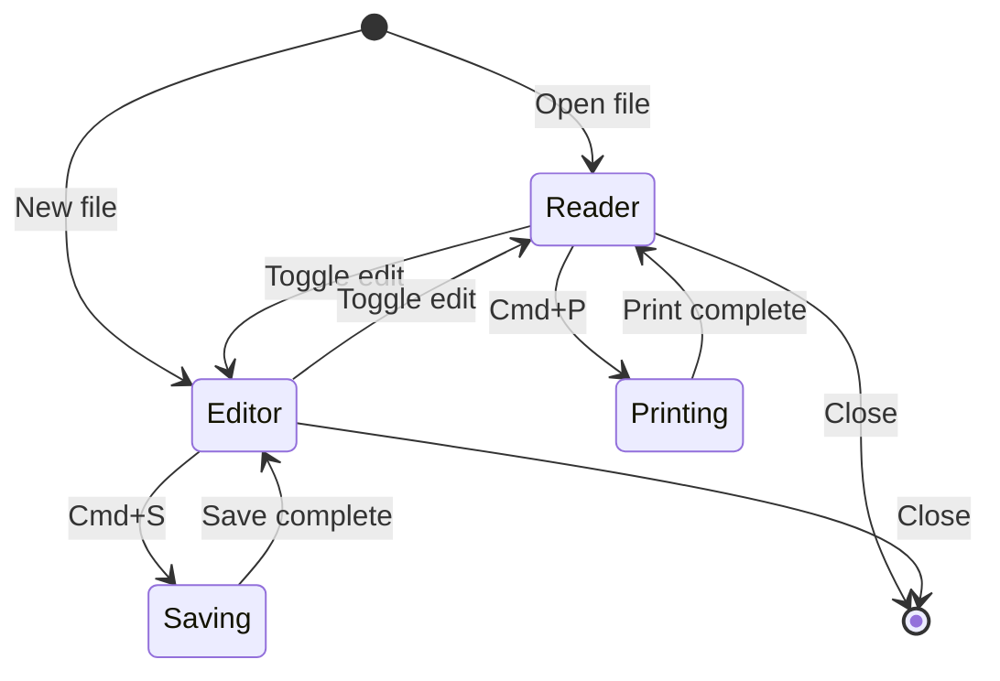

# VoidReader Vibe Check

A comprehensive test document exercising every feature. If this renders beautifully, we're golden.

---

## Typography & Text Formatting

### The Basics

Regular paragraph text. Nothing fancy, just words doing their thing.

**Bold text** for emphasis. *Italic text* for that subtle flair. ***Bold and italic*** when you really mean it.

~~Strikethrough~~ for when you change your mind. `Inline code` for the technical bits.

### All Heading Levels

# Heading 1 - The Big One
## Heading 2 - Still Important
### Heading 3 - Getting Cozy
#### Heading 4 - The Details
##### Heading 5 - Fine Print
###### Heading 6 - Whispers

---

## Links

[External link to GitHub](https://github.com)

[Link with title](https://example.com "Example Site")

Autolink: https://void.reader.app

Email autolink: contact@example.com

---

## Images

### Local Image

The VoidReader icon, rendered from the repo:


### Remote Image

A classic placeholder from the internet:


---

## Lists

### Unordered List

- First item
- Second item
  - Nested item A
  - Nested item B
    - Deep nested
- Third item

### Ordered List

1. Step one
2. Step two
   1. Sub-step A
   2. Sub-step B
3. Step three

### Task List

- [x] Implement markdown rendering
- [x] Add Mermaid diagram support
- [x] Build edit mode with live preview
- [x] Add inline math support
- [ ] World domination
- [ ] Take a vacation

---

## Blockquotes

> "The best markdown viewer is one that doesn't make you think about the viewer."
>
> — Someone who definitely exists

Nested quotes:

> Level 1 quote
> > Level 2 quote
> > > We need to go deeper

---

## Code Blocks

### Swift

```swift
struct MarkdownViewer: View {
    let document: MarkdownDocument

    var body: some View {
        ScrollView {
            MarkdownReaderView(text: document.text)
                .padding(40)
                .frame(maxWidth: 720)
        }
    }
}
```

### Python

```python
def render_markdown(text: str) -> str:
    """Render markdown to HTML. But we don't do that here."""
    # VoidReader uses native rendering, no HTML needed
    return native_render(text)
```

### JSON

```json
{
  "app": "VoidReader",
  "version": "0.3.0",
  "features": ["markdown", "mermaid", "math", "vibes"]
}
```

### Shell

```bash
# Build and run VoidReader
make project && make build && make run
```

---

## Tables

### Basic Table

| Feature | Status | Notes |
|---------|--------|-------|
| Markdown | Done | Full GFM support |
| Mermaid | Done | Bundled JS, no Node |
| Math | Done | Block + inline |
| Themes | Done | System + Catppuccin |

### Aligned Columns

| Left | Center | Right |
|:-----|:------:|------:|
| L1 | C1 | R1 |
| L2 | C2 | R2 |
| L3 | C3 | R3 |

### Wide Table

| ID | Name | Description | Status | Priority | Assignee | Due Date |
|----|------|-------------|--------|----------|----------|----------|
| 1 | Feature A | Important stuff | Done | High | Alice | 2026-01-15 |
| 2 | Feature B | More stuff | In Progress | Medium | Bob | 2026-02-01 |
| 3 | Feature C | Future stuff | Planned | Low | TBD | 2026-03-01 |

---

## Mathematics

### Inline Math

The quadratic formula gives us $x = \frac{-b \pm \sqrt{b^2-4ac}}{2a}$ for any quadratic equation.

Einstein's famous equation $E = mc^2$ changed physics forever.

Greek letters like $\alpha$, $\beta$, and $\gamma$ are common in math.

Subscripts $x_1, x_2, \ldots, x_n$ and superscripts $2^{10} = 1024$.

### Block Math

The Pythagorean theorem:

$$
a^2 + b^2 = c^2
$$

Euler's identity, often called the most beautiful equation:

$$
e^{i\pi} + 1 = 0
$$

A more complex integral:

$$
\int_{-\infty}^{\infty} e^{-x^2} dx = \sqrt{\pi}
$$

Matrix notation:

$$
\begin{pmatrix}
a & b \\
c & d
\end{pmatrix}
\begin{pmatrix}
x \\
y
\end{pmatrix}
=
\begin{pmatrix}
ax + by \\
cx + dy
\end{pmatrix}
$$

---

## Mermaid Diagrams

### VoidReader Architecture



### Document Flow



### State Machine



---

## Horizontal Rules

Above the line.

---

Below the line.

***

Another style.

___

And another.

---

## Edge Cases

### Long Unbroken Line

Thisisaverylongwordthathasnospacesandshouldtesthowthetextrendererhandlesoverflowsituationswithoutbreakingtheentirelayout.

### Unicode & Emoji

日本語テスト。中文测试。한국어 테스트.

Emoji parade: 🚀 🎨 📝 ✨ 🔥 💯 🎉 👀 🤖 🦀

### Special Characters

Ampersand: &
Less than: <
Greater than: >
Quote: "
Apostrophe: '
Backslash: \
Backtick: \`

### Nested Formatting

**Bold with *italic* inside**

*Italic with **bold** inside*

~~Struck with **bold** and *italic*~~

`Code with no *formatting* inside`

---

## The End

If you made it here and everything looks good, VoidReader is vibing.

Built with care, caffeine, and Claude. ✨
